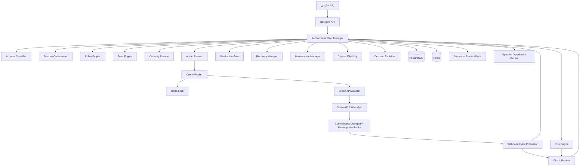
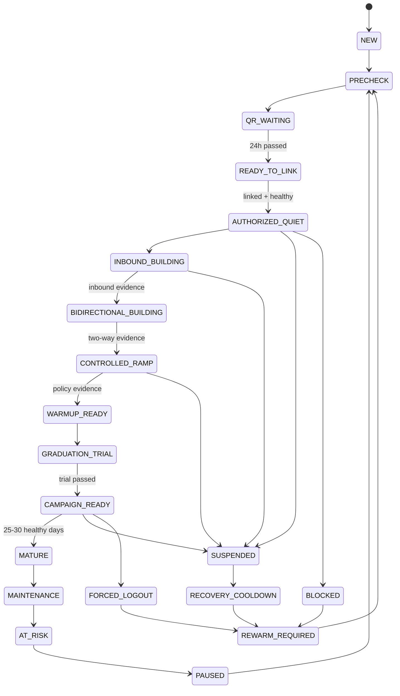
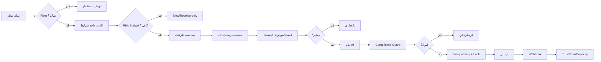

# سند معماری نهایی V67.1
## مدیر خودران ناوگان واتساپ افراپیام

**نسخه:** V67.1  
**وضعیت:** مشخصات نهایی پیش از ممیزی فاز ۰  
**هدف:** خودکارسازی حداکثری چرخه عمر اکانت؛ از ثبت تا گرم‌سازی، آمادگی کمپین، نگهداری، بازیابی، ظرفیت‌سنجی و ارسال کنترل‌شده.

## 1. تغییرات قطعی پاسخ Green API

1. بازه `12 → 100` = مجموع پیام‌های ورودی + خروجی روزانه.
2. `100` معیار پیشنهادی؛ نه سقف رسمی، تضمین، یا هدف اجباری.
3. اکانت‌های گرم موجود می‌توانند اکانت جدید را گرم کنند؛ نسبت ثابت `1:3` تأیید نشده.
4. گفت‌وگوهای واقعی بیشتر بهتر؛ الگوی مصنوعی و تکراری ممنوع.
5. مخاطبان باید در دفترچه تلفن اصلی گوشی ذخیره شوند.
6. روش تایپ ترجیحی: `autoTyping`.
7. تشخیص اصلی وضعیت: `stateInstanceChanged`; تأیید تکمیلی و `suspendedUntil`: `getWaSettings`.
8. پس از `suspended`, `blocked`, خروج اجباری، محدودیت دستگاه متصل: گرم‌سازی از ابتدا.
9. نگهداری: چند پیام واقعی روزانه؛ عدد دقیق رسمی وجود ندارد.
10. گرم‌سازی از گوشی یا API تفاوت مهم اعلام‌شده ندارد.
11. اثر شماره‌های متوالی: `Unknown`؛ فقط Cohort کوچک، Device مجزا، داده‌برداری.
12. هشدار زودهنگام رسمی: خروج اجباری؛ سیستم فقط تخمین ریسک می‌دهد.

## 2. اصول غیرقابل‌مذاکره

- `apiTokenInstance` فقط Backend؛ هرگز Frontend/Log/LocalStorage.
- دریافت پیام فقط Webhook؛ Health Check سبک وضعیت مجاز.
- تعامل جعلی، حلقه پیام مصنوعی، تماس صوری، جعل رفتار ممنوع.
- فقط افراد و مخاطبان واقعی، رضایت‌داده.
- `STOP` و Blacklist فوری و سراسری.
- AI فقط پیشنهاد؛ Rule Engine تصمیم نهایی.
- همه تصمیم‌ها و Actionها توضیح‌پذیر، نسخه‌بندی‌شده، Audit شده.
- ارسال واقعی فقط پس از Simulation، E2E، Shadow، Canary، تأیید مالک.
- هیچ سرویس سالم قبلی حذف نشود؛ ابتدا Audit، سپس Adapter و Orchestrator.
- روز ۱۰ فقط `WARMUP_READY`.
- همه Incidentهای اصلی باعث `REWARM_REQUIRED`.

## 3. تجربه نهایی مالک

مالک فقط اکانت، زمان ثبت، دستگاه، دوستان واقعی، مخاطبان مجاز، ساعات ارسال، Policy را وارد می‌کند؛ سپس Autopilot را فعال می‌کند.

```text
Classify
→ Preflight
→ Select Journey
→ Plan Actions
→ Execute Within Policy
→ Observe Webhooks
→ Update Trust/Risk
→ Graduate
→ Warm Pool
→ Maintain
→ Calculate Capacity
→ Campaign
→ Live Product/Price
→ Send
→ Learn/Recover
```

## 4. معماری

### رابط
- Fleet Dashboard
- Accounts
- Human Participants
- Campaign Contacts
- Policies
- Incidents
- Simulations
- Decisions
- Audit

### مدیر خودران
- `AccountClassifier`
- `JourneyOrchestrator`
- `PolicyEngine`
- `TrustEngine`
- `RiskEngine`
- `CapacityPlanner`
- `ActionPlanner`
- `CampaignPlanner`
- `ContactEligibilityEngine`
- `GraduationGate`
- `RecoveryManager`
- `MaintenanceManager`
- `DecisionExplainer`

### سرویس‌های موجود؛ استفاده مجدد
- Accounts
- Mesh/Team collaboration
- Campaign
- Green API client
- Webhook
- Celery/Redis
- Rate limit/random delay/daily limit
- Health gate/FanOutGuard
- Blacklist/delivery
- AI providers
- Product/price
- Status/Inbox

اصل: Wrapper/Adapter؛ نه موتور موازی.

## 5. State Machine

| State | معنی | خروجی مجاز |
|---|---|---|
| `NEW` | ثبت‌شده | هیچ |
| `PRECHECK` | بررسی اولیه | هیچ |
| `QR_WAITING` | انتظار ۲۴ ساعت | هیچ |
| `READY_TO_LINK` | مجاز به اتصال | اتصال |
| `AUTHORIZED_QUIET` | متصل، API خاموش | دریافت |
| `INBOUND_BUILDING` | ساخت ورودی | دریافت |
| `BIDIRECTIONAL_BUILDING` | پاسخ محدود | پاسخ واقعی |
| `CONTROLLED_RAMP` | افزایش total flow | محدود |
| `WARMUP_READY` | مسیر پایه کامل | Trial |
| `GRADUATION_TRIAL` | آزمون محدود | کمپین کوچک |
| `CAMPAIGN_READY` | آماده کمپین | ظرفیت‌محور |
| `MATURE` | ۲۵–۳۰ روز سالم | ظرفیت Policy |
| `MAINTENANCE` | حفظ گرمی | چند تعامل واقعی |
| `AT_RISK` | ریسک بالا | کاهش/Receive-only |
| `PAUSED` | توقف | هیچ |
| `SUSPENDED` | محدودیت موقت | خروجی ممنوع |
| `BLOCKED` | مسدود | توقف کامل |
| `FORCED_LOGOUT` | خروج اجباری | ورود فوری ممنوع |
| `RECOVERY_COOLDOWN` | انتظار | محدود |
| `REWARM_REQUIRED` | Reset | شروع مجدد |
| `FAILED` | شکست مکرر | دستی |
| `RETIRED` | خروج دائمی | هیچ |

گذارها شرط‌محور: زمان + سلامت + شواهد + Queue + Webhook + Native contact + Risk.

## 6. Journeyها

### جدید
`NEW → PRECHECK → QR_WAITING → READY_TO_LINK → AUTHORIZED_QUIET → INBOUND_BUILDING → BIDIRECTIONAL_BUILDING → CONTROLLED_RAMP → WARMUP_READY → GRADUATION_TRIAL → CAMPAIGN_READY → MATURE → MAINTENANCE`

### Authorize بدون فعالیت
بر اساس first/last inbound/outbound، active days، unique chats، incidents؛ در نبود شواهد: `INBOUND_BUILDING`.

### گرم موجود
Preflight → inactivity/incident check → limited trial → ready/maintenance.

### Suspend
`SUSPENDED → stop outbound → getWaSettings → save suspendedUntil → cooldown → verify → REWARM_REQUIRED`.

### Block/Logout/Device restriction
`Stop → Incident → no immediate relogin → REWARM_REQUIRED`.

## 7. Metrics

```text
total_daily_flow = incoming_messages + outgoing_messages
```

همراه:
- unique_inbound_chats
- unique_outbound_chats
- bidirectional_chats
- replying_contact_ratio
- conversation_ratio

`12 → 100` در Policy؛ Hard-code ممنوع.

## 8. پنج موتور امتیاز

- Trust Score: روز فعال، مخاطب یکتا، ورودی آغازشده، دوطرفه، پاسخ، ثبات، تحویل.
- Health Score: state, webhook freshness, queue, delivery, settings, worker.
- Risk Score: incident، جهش حجم، پاسخ پایین، محتوای تکراری، device reuse، inactivity.
- Activity Score: فعالیت واقعی و استمرار.
- Compliance Score: رضایت، STOP، Native contact، ساعات مجاز، قیمت درست.

Risk Budget:
`NORMAL → SLOW → RECEIVE_ONLY → PAUSED → REWARM_REQUIRED`

## 9. Maturity Certificate

- minimum age
- active days
- inbound diversity
- bidirectional chats
- response ratio
- delivery health
- queue health
- webhook health
- incident-free window
- graduation trial
- native contacts
- device stability

## 10. Human Participants

- `CONNECTED_WARMER_ACCOUNT`: سیستم اختیار ارسال دارد.
- `HUMAN_PARTICIPANT`: سیستم فقط Task/Reminder؛ ارسال از طرف انسان ممنوع.

فیلدها: name, phone, relationship, consent, native_contact_verified, hours, cooldown, reliability.

## 11. Device Registry

- device_id/model/os/imei_hash
- account_id
- first_seen/last_seen
- active_account_count
- registration_count_24h
- device_change_count
- risk_flag
- number_batch_id

پیش‌فرض: یک اکانت فعال اصلی برای هر Device. اثر رنج متوالی Unknown.

## 12. Scheduling

- Planner Tick هر ۵ دقیقه.
- `next_action_at` مستقل + Jitter.
- missed slots: Skip؛ Catch-up ممنوع.
- Atomic claim + Redis lock + Idempotency.
- Key: `account_id + journey_id + action_type + scheduled_slot`.

## 13. Green API

- `stateInstanceChanged`: منبع فوری.
- `getWaSettings`: state + suspendedUntil.
- `getSettings`: webhook + autoTyping.
- `getStateInstance`: health check سبک.
- Typing: `autoTyping`؛ `typingTime` override؛ `SendTyping` fallback.
- Native phone address book اجباری.

## 14. Campaign Autopilot

Fleet health → eligible accounts → risk budget → capacity → eligible contacts → STOP/cooldown → live product/price → AI structured message → compliance guard → schedule → send → webhook feedback → recalculation → breaker.

## 15. Product/Price

- Supabase live
- Cache ≤۶۰ ثانیه
- Snapshot ساخت/ارسال
- stale/unavailable/out-of-stock: no send
- AI حق ساخت قیمت ندارد

## 16. AI Governance

مجاز: پیشنهاد پیام، زمان داخل Window، توزیع ظرفیت، توضیح تصمیم، پیشنهاد Policy.

ممنوع: عبور سقف، ارسال از Suspend، حذف STOP، تغییر Secret، ارسال خارج Window، تغییر Policy بحرانی، جعل تعامل.

## 17. Circuit Breaker

توقف اگر:
- ۲ Suspend متمایز در ۲۴ ساعت
- Block/Forced logout
- Webhook stale
- duplicate send
- queue backlog
- price invalid
- STOP failure
- DB/Redis inconsistency
- unknown state

Reset فقط مالک + Preflight + گزارش.

## 18. Simulation

Virtual Clock، Fake Green API، Synthetic Webhooks، fault injection، duplicate/lost events، Suspend/Block، Queue، Worker/Redis/DB، Supabase/AI، price، STOP، device change، sequential Cohort.

## 19. امنیت

Secret encryption، masked logs، RBAC، audit، no token frontend، minimum PII، consent evidence، retention، rate limits، CSRF/CORS/auth.

## 20. مهاجرت از کد موجود

Audit → Map → Adapter → Shadow → Compare → per-account Cutover → Deprecate → Remove only after rollback-tested release.

## 21. تعریف موفقیت

۹۹٪ خودکارسازی عملیات؛ نه ۹۹٪ تضمین عدم Ban.
# نمودار معماری V67.1







اصطلاحات:
- Autonomous Fleet Manager: مدیر خودران ناوگان
- Journey Orchestrator: هماهنگ‌کننده مسیر
- Circuit Breaker: مدار قطع اضطراری
- Shadow Mode: اجرای سایه
- Canary: اجرای محدود آزمایشی
- Cohort: دسته آزمایشی
- Idempotency: جلوگیری از اثر دوباره اجرای تکراری
# راهنمای آموزشی مالک/اپراتور V67.1

## 1. پیش از ثبت

برای هر شماره: اپراتور، Batch، متوالی‌بودن، Device، زمان ثبت WhatsApp، سابقه Incident، افراد رضایت‌داده.

اثر شماره‌های متوالی: Unknown؛ امن یا خطرناک قطعی فرض نشود.

## 2. ثبت شماره جدید

1. WhatsApp روی گوشی واقعی.
2. پروفایل واقعی.
3. دوستان در دفترچه تلفن اصلی گوشی.
4. زمان ثبت در افراپیام.
5. ۲۴ ساعت بدون QR.
6. پس از `READY_TO_LINK` اسکن QR.
7. بررسی `stateInstanceChanged` و Webhook.
8. ورود به `AUTHORIZED_QUIET`.

## 3. دوستان و آشنایان

ثبت: نام، شماره، رابطه، رضایت، ساعات، سقف فعالیت، نوع فعالیت، Native-contact verification.

- انسان واقعی: سیستم Task می‌سازد؛ ارسال دستی.
- اکانت گرم متصل: ارسال خودکار Policy-based.

## 4. مخاطبان تبلیغاتی

فقط: رضایت/رابطه واقعی، WhatsApp معتبر، عدم STOP/Blacklist، cooldown، ساعت مجاز.

## 5. ساعات

نمونه: شنبه–پنجشنبه 10:00–19:00؛ جمعه خاموش. Action عقب‌افتاده فشرده جبران نمی‌شود.

## 6. Policy

- `CONSERVATIVE`: پیش‌فرض، شماره جدید/سازمانی/متوالی/Incident.
- `BALANCED`: فقط سابقه سالم.
- `EXPERIMENTAL`: Cohort کوچک، تأیید مالک.

## 7. فعال‌سازی

Dashboard → Preflight → رفع خطا → Simulation summary → Enable Autopilot. ارسال واقعی فقط پس از Canary.

## 8. وضعیت‌ها

- `QR_WAITING`: QR نزنید.
- `INBOUND_BUILDING`: دریافت واقعی.
- `BIDIRECTIONAL_BUILDING`: پاسخ محدود.
- `CONTROLLED_RAMP`: مجموع ورودی+خروجی تدریجی.
- `WARMUP_READY`: هنوز کمپین کامل ممنوع.
- `GRADUATION_TRIAL`: آزمون کوچک.
- `CAMPAIGN_READY`: آماده ظرفیت‌محور.
- `MATURE`: تثبیت‌شده.
- `AT_RISK`: کندسازی.
- `SUSPENDED`: خروجی ممنوع.
- `BLOCKED`: توقف کامل.
- `REWARM_REQUIRED`: شروع مجدد.

## 9. بررسی روزانه

- Ready accounts
- ظرفیت امروز
- Risk
- Queue
- Webhook
- STOP
- Product/price errors
- Incident
- دلیل تصمیم

## 10. Suspend

انجام ندهید: ارسال، QR فوری، کمپین دستی، تغییر Device. سیستم توقف، `getWaSettings`, ذخیره `suspendedUntil`, سپس Rewarm.

## 11. Block/Forced Logout

ورود فوری ممنوع؛ Incident، بررسی Device/Instance، تأیید مالک، سپس `REWARM_REQUIRED`.

## 12. STOP

Blacklist سراسری، لغو Actionهای آینده، ثبت دلیل.

## 13. قیمت

پیش از ارسال قیمت/موجودی/زمان به‌روزرسانی بررسی؛ خطا یا کهنگی = توقف.

## 14. ممنوع

دورزدن Risk، کمپین موازی، حذف Incident، Queue clear بی‌دلیل، جابه‌جایی Device، QR تکراری، Token در Browser، شماره بدون رضایت، Experimental سراسری.

## 15. چک‌لیست روزانه

- [ ] هشدار بحرانی صفر
- [ ] Webhook سالم
- [ ] Queue عادی
- [ ] قیمت معتبر
- [ ] STOP پردازش‌شده
- [ ] Suspend در ارسال نیست
- [ ] ظرفیت توضیح‌پذیر
- [ ] Action تکراری صفر
# سند اجرایی فازبندی‌شده V67.1

## قوانین

- هر بار فقط یک فاز.
- پایان: Test، Report، Commit، Stop.
- ارسال واقعی تا Canary ممنوع.
- حذف کد موجود تا Cutover و Rollback test ممنوع.
- فرض ناسازگار = Hard Stop.
- Migration با Down script.
- Token Frontend ممنوع.

## فاز ۰ — Audit فقط‌خواندنی

هدف: Map دقیق Accounts, Mesh, Campaign, Webhook, Celery, Queue, Lock, Typing, Incident, connected_at, first activity, tests, branches.

خروجی:
- `docs/v67/00-audit.md`
- `01-existing-capability-map.md`
- `02-gap-analysis.md`
- `03-conflict-map.md`
- `04-reuse-plan.md`
- `05-migration-plan.md`

پذیرش: هیچ تغییر. زمان: ۱–۲ روز.

## فاز ۱ — P0های حیاتی

Webhook dedup، Incident برای Suspend/Block/Logout، منع انتخاب ناسالم، first/last activity، `stateWebhook`, `getWaSettings`, Queue health، Circuit Breaker.

پذیرش: Duplicate صفر؛ Suspend قابل ارسال نیست. زمان: ۱–۲ روز.

## فاز ۲ — مدل داده/Policy

fleet_accounts, journeys, actions, metrics, incidents, policies, humans, device_registry, certificates, capacity_decisions.

پذیرش: up/down، idempotency unique، secret leakage صفر. زمان: ۱–۲ روز.

## فاز ۳ — Green API Adapter/Telemetry

state webhook، getWaSettings، getSettings، getStateInstance، Queue، autoTyping، event dedup.

پذیرش: contract tests، suspendedUntil، yellowCard mapping. زمان: ۱–۲ روز.

## فاز ۴ — Classifier/Journey

مسیر New/Inactive/Warm/Suspended/Blocked/Logout، conditional transition، reset، policy snapshot.

پذیرش: Day-only ممنوع؛ بدون ارسال واقعی. زمان: ۲–۳ روز.

## فاز ۵ — Scheduler/Lock/Ledger

Tick ۵ دقیقه، next_action_at، Jitter، atomic claim، Redis lock، idempotency، skip missed، dead-letter.

پذیرش: دو Worker=یک Action؛ خاموشی=بدون Burst. زمان: ۲ روز.

## فاز ۶ — Trust/Risk/Capacity

پنج Score، Risk budget، Dynamic capacity، decision explanation، total flow.

پذیرش: low response ظرفیت را کم کند؛ Incident=صفر. زمان: ۲–۳ روز.

## فاز ۷ — Human/Native Contacts

Task انسانی، warmer account، consent، native-contact، cooldown، reliability.

پذیرش: از طرف انسان غیرمتصل ارسال نشود. زمان: ۲ روز.

## فاز ۸ — Graduation/Maintenance

Certificate، Trial، pools، maintenance.

پذیرش: Day 10 فقط WARMUP_READY؛ Trial failure مانع Graduation. زمان: ۱–۲ روز.

## فاز ۹ — Product/Price/Campaign Autopilot

eligible contacts، capacity allocation، live product/price، AI structured output، compliance guard، STOP، feedback.

پذیرش: stale/out-of-stock=no send؛ Window enforced. زمان: ۳–۴ روز.

## فاز ۱۰ — Recovery

suspendedUntil، blocked، logout، device restriction، rewarm، failed/retired.

پذیرش: direct resume ممنوع؛ reset traceable. زمان: ۱–۲ روز.

## فاز ۱۱ — Dashboard

pools، timeline، scores، capacity، incidents، decisions، simulations، Cohort stats.

پذیرش: RTL، masked secrets، live، reason visible. زمان: ۲–۳ روز.

## فاز ۱۲ — Simulation/Shadow/Canary/Cohort

Simulation ۳۰ روز؛ Shadow؛ Canary ۱، ۲؛ Cohort ۵، ۱۰؛ rollout تدریجی.

شماره متوالی: Unknown، Device مجزا، Batch کوچک، Control group در صورت امکان.

پذیرش: breaker/rollback tested، owner approval. زمان توسعه ۲–۳ روز + مشاهده ۳–۷ روز.

## E2E

1. NEW→CAMPAIGN_READY
2. Suspend وسط Ramp
3. Block
4. Forced logout
5. دو Worker
6. خاموشی ۸ ساعت
7. Webhook duplicate
8. Queue backlog
9. Price change
10. Out-of-stock
11. STOP
12. AI failure
13. Redis failure
14. Device change
15. Native contact false
16. Low reply
17. Circuit breaker
18. Rollback

## توقف اضطراری

۲ Suspend در ۲۴ ساعت؛ Block؛ Forced logout؛ Duplicate؛ Webhook stale؛ Queue abnormal؛ Price invalid؛ STOP failure؛ lock failure؛ unknown state؛ DB/Redis drift.

## حلقه ۷مرحله‌ای

1. Support/document contract
2. Existing-code reuse
3. State completeness
4. Trust/risk/capacity
5. Incident/recovery
6. Simulation/E2E
7. Security/quality/integration

## Git

Commit جدا؛ `git add -A`, `git reset --hard`, `git clean -fd`, `git push --force` ممنوع.

## دستور Cursor

```text
Read `V67_1_AUTONOMOUS_FLEET_MANAGER_MASTER.md` completely.

Execute ONLY Phase 0.

Do not modify code, database, Green API settings, accounts, webhooks, queues, campaigns, or real WhatsApp state.

Inspect all relevant branches, migrations, warm-up/mesh code, campaign scheduling, Green API adapters, webhooks, Celery tasks, locks, incidents, account metrics, tests, and frontend.

Create only:
- docs/v67/00-audit.md
- docs/v67/01-existing-capability-map.md
- docs/v67/02-gap-analysis.md
- docs/v67/03-conflict-map.md
- docs/v67/04-reuse-plan.md
- docs/v67/05-migration-plan.md

Report exact reusable components, duplicate risks, contradicted assumptions, missing capabilities, proposed migrations, hard stops.

Stop after Phase 0. Wait for explicit `Phase 1`.
```
