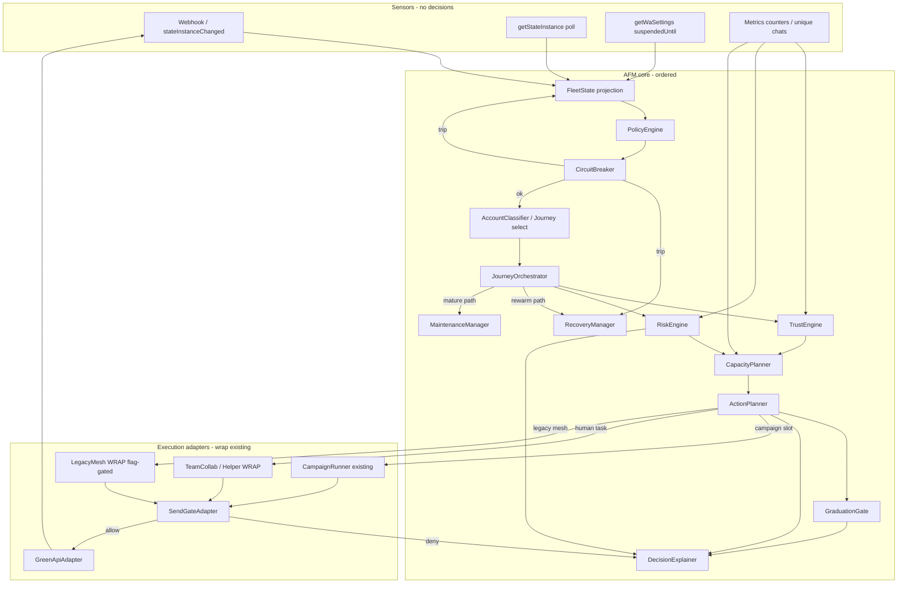

# V67.1 Phase 0.5 — Dependency Graph

Exact execution order for AFM runtime. No parallel authority for send decisions.

---

## 1. Mermaid — control flow (single tick / send)



---

## 2. Strict ordered pipeline (must not reorder)

### On every webhook / poll observation

1. Persist sensor (`InstanceLiveState`, counters, incidents)  
2. Update **FleetState** projection (matrix rules)  
3. Emit domain event to AFM bus  
4. If danger → **CircuitBreaker** evaluate → maybe force FleetState / pause  
5. **RecoveryManager** if SUSPENDED/BLOCKED/LOGOUT paths  
6. **DecisionExplainer** log  

### On every planner tick (≈5 min)

1. Load account + **FleetState**  
2. **CircuitBreaker** precheck (fleet health, webhook freshness, queue, redis) — stop if tripped  
3. **PolicyEngine** resolve effective policy snapshot  
4. **AccountClassifier** / journey continuity  
5. **JourneyOrchestrator** propose stage goals  
6. **TrustEngine** + **RiskEngine** (parallel inputs OK; both finish before capacity)  
7. Apply **risk_budget** overlay  
8. **CapacityPlanner** → today’s allow  
9. **GraduationGate** / **MaintenanceManager** as stage-appropriate  
10. **ActionPlanner** create/claim actions (idempotent keys)  
11. **DecisionExplainer** persist  
12. Execute via adapters → **always SendGate** → **GreenApiAdapter** / CampaignRunner  

### On campaign send (existing runner under AFM)

```
Fleet health OK?
 → eligible FleetStates (CAMPAIGN_READY|MATURE|MAINTENANCE|GRADUATION_TRIAL)
 → risk_budget allows outbound
 → CapacityPlanner remaining
 → ContactEligibility + STOP
 → PriceAdapter valid
 → AI suggest message (optional)
 → Compliance guard
 → CampaignRunner._deliver_message
 → send_gate.gate_check
 → Green API
 → webhook feedback → metrics → Trust/Risk recalc
```

---

## 3. Component dependency table

| Component | Depends on | Must not depend on |
|---|---|---|
| FleetState | AccountStatus, WarmupState (legacy), live state, incidents, onboarding timestamps | CampaignRunner, AI |
| PolicyEngine | fleet_policies DB | Green API side effects |
| CircuitBreaker | FleetState, incidents, queue/webhook health, redis/db probes | AI |
| JourneyOrchestrator | FleetState, Policy | CampaignRunner internals |
| TrustEngine | metrics, delivery, activity | Send path |
| RiskEngine | incidents, volume_guard inputs, content repetition signals | AI caps |
| CapacityPlanner | Policy, Trust, Risk, real_sent_today, governors | AI raising caps |
| ActionPlanner | Capacity, Journey, hours/jitter | Bypassing SendGate |
| CampaignRunner | ActionPlanner approval (when AFM on), FanOut, gates | Setting FleetState |
| GreenApiAdapter | SendGate allow | Policy mutation |
| RecoveryManager | incidents, getWaSettings, FleetState | Silent resume to CAMPAIGN_READY |
| DecisionExplainer | all prior outputs | Mutating state |

---

## 4. Coexistence with legacy Celery ticks

During Shadow:

| Tick | Owner |
|---|---|
| `process-mesh-warmup` | Legacy (source of send truth if MESH on) |
| `process-team-schedule` / helpers | Legacy WRAP |
| `process-*-warmup` group/cold/thankyou | Legacy |
| AFM planner (new) | Shadow decisions only |
| `poll-instance-states` / webhooks | Shared sensors |
| `run_campaign` | Legacy until canary |

After cutover per account: AFM planner claims actions; legacy ticks **no-op** when `fleet_accounts.cutover=true`.

---

## 5. Circuit breaker precedence

```
Fleet CircuitBreaker TRIPPED
  → block ActionPlanner outbound
  → pause CampaignPlanner
  → mesh killswitch may also pause mesh (independent)
  → reset ONLY owner + preflight + report
```

Mesh 48h breaker does not clear fleet 24h Suspend breaker (and vice versa) until unified (owner D-C1).

---

## 6. Master phase identity note (owner 2026-08-05)

Master **فاز ۸** remains **Graduation / Maintenance** (`109`). It is not Shadow Bridge, Dual Evaluation, or Decision Replay. Execution Phase 7 Shadow observation continues separately until Fully Accepted. DecisionExplainer in this graph is a shared diagnostic dependency, not a Phase 8 Graduation feature and not a license to start Phase 8 during Session 2.
